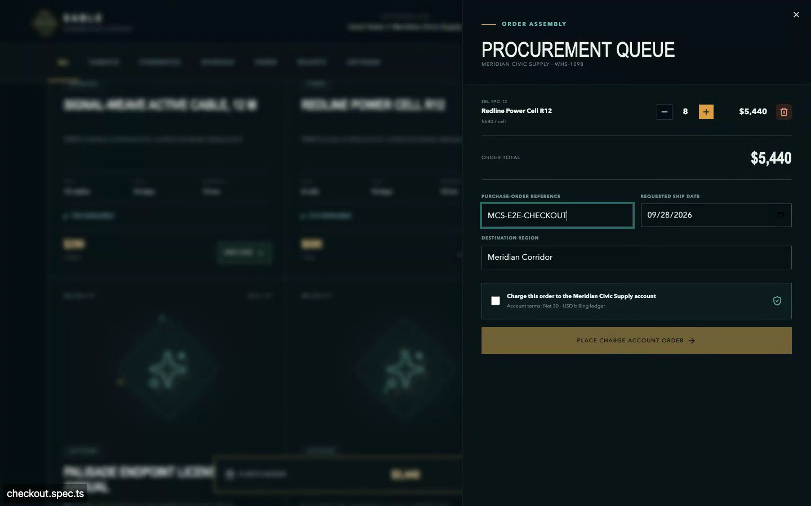

# SABLE Systems Distribution Portal

A local web application for the fictional SABLE Systems wholesale business.
The portal provides inventory-aware ordering, charge-account checkout, order
history, and COV-E customer support. This branch trials DeepSeek V4.1 Flash
through OpenRouter. No local model weights or inference server are required.

Built with React, Vinext, and Tailwind CSS, with a Cloudflare Workers backend
and a D1/SQLite database.

## Demos

Select a thumbnail to open the video.

| Order to support · 36 seconds                                                                                                    | Playwright checkout test · 21 seconds                                                                                                                         |
| -------------------------------------------------------------------------------------------------------------------------------- | ------------------------------------------------------------------------------------------------------------------------------------------------------------- |
| [](docs/media/app-demo.mp4)                                                        | [](docs/media/checkout-test.mp4)                                                                |
| Place an order, then ask COV-E for its details and shipment status. This recording shows the historical local inference version. | Watch the existing checkout test run and its passing report. Checks cover cart removal, account charges, inventory reservations, and persisted order history. |

## Setup

Requirements:

- Node.js 22.13 or later and npm.
- An OpenRouter API key with credits for hosted inference.

Install dependencies from the repository root:

```sh
npm ci
```

Create the ignored local environment file if it is missing:

```sh
cp .env.example .env
```

Fill in `OPENROUTER_API_KEY=` in `.env`, then start:

```sh
npm run dev
```

Open [http://127.0.0.1:8016](http://127.0.0.1:8016). The launcher starts the web
app and uses the OpenRouter key server-side. Press Control-C to stop it.

Inference pins `deepseek/deepseek-v4.1-flash` to the DeepInfra FP8 endpoint, disables
provider fallback, and retains the authorization, grounding, and corrective-retry
checks. COV-E disables reasoning; the advisory judge uses `z-ai/glm-5.3-flash`
with reasoning enabled and a
16,384-token output budget. Hosted requests send the question, scoped records,
and saved conversation history to OpenRouter and the selected provider. See
[OpenRouter inference](docs/inference.md) for testing and Cloud setup.

## Configuration

The application listens on `127.0.0.1:8016`. Inference uses OpenRouter HTTPS.
The launchers read `.env`; shell values take precedence. Unconfigured checkouts
require an API key for inference. `.env.example` contains the supported settings.

| Variable                      | Purpose                                   | Default                               |
| ----------------------------- | ----------------------------------------- | ------------------------------------- |
| `OPENROUTER_API_KEY`          | Server-side OpenRouter secret             | No key; required for hosted inference |
| `OPENROUTER_SUPPORT_MODEL`    | Hosted COV-E model ID                     | `deepseek/deepseek-v4.1-flash`        |
| `OPENROUTER_JUDGE_MODEL`      | Hosted advisory judge model ID            | `z-ai/glm-5.3-flash`                  |
| `OPENROUTER_JUDGE_REASONING`  | Hosted judge reasoning, `true` or `false` | `true`                                |
| `OPENROUTER_JUDGE_MAX_TOKENS` | Hosted judge reasoning plus verdict limit | `16384` (range `256`–`32768`)         |
| `SITE_URL`                    | Base URL for site metadata                | `http://127.0.0.1:8016`               |

The chat and judge defaults and provider/privacy policies are configured separately
in `lib/openrouter-config.json`. COV-E uses an 8,192-token prompt
budget with a 600-token reply limit and reasoning disabled. The judge uses
reasoning and a 16,384-token completion limit. Existing environment overrides
still take precedence; raise an explicit `OPENROUTER_JUDGE_MAX_TOKENS=8192`
override to `16384` to use the larger cap. Chat model overrides must be supported by the pinned DeepInfra FP8 endpoint.
The judge lets OpenRouter select a compatible endpoint with required parameters,
zero data retention, and data collection denied; there is no provider fallback.

## Usage

| Route      | Function                                              |
| ---------- | ----------------------------------------------------- |
| `/`        | Brand landing page                                    |
| `/login`   | Distributor sign-in                                   |
| `/shop`    | Catalog, case-pack cart, and charge-account checkout  |
| `/orders`  | Distributor order history, search, and status filters |
| `/support` | COV-E chat and per-user incident history              |

Sign in with a seeded local account:

| Distributor                       | Email                              | Access phrase     |
| --------------------------------- | ---------------------------------- | ----------------- |
| Calder Pike Distribution          | `mara.venn@calderpike.example`     | `Sable-WHS-0427!` |
| Meridian Civic Supply             | `imani.kade@meridiancivic.example` | `Sable-WHS-1098!` |
| Northline Prosthetics Cooperative | `rowan.sato@northline.example`     | `Sable-WHS-2714!` |
| Halcyon Industrial Exchange       | `lena.orr@halcyonexchange.example` | `Sable-WHS-5830!` |

Checkout reserves available inventory and validates case-pack quantities,
purchase-order references, and requested ship dates. COV-E provides read-only
assistance with authorized orders, shipments, returns, account charges, support
incidents, and inventory.

## Local data

The database initializes automatically with four distributors, catalog inventory,
orders dated 2021–2031, shipments, returns, account records, and support incidents.

- Database state and runtime files: `.wrangler/`
- Model server logs: `reports/server-logs/`
- Schema and seed definitions: [db/schema.ts](db/schema.ts) and [db/seed.ts](db/seed.ts)

Runtime directories are Git-ignored. Existing records are preserved on startup;
interrupted initialization resumes from the last committed batch.

### Data maintenance

Schema versions 6, 7, and 8 upgrade to 9 with the current `SEED_VERSION`. Unsupported
versions or populated databases without version metadata stop startup without
modifying records. Preserve the database and inspect its metadata before migration.

Seed changes must update `SEED_VERSION` to prevent resuming initialization with a
different dataset. A version change does not reset existing data; rebuilding the
dataset requires a separate, explicit reset.

## Security boundaries

This is a local demo with synthetic data and published demo credentials.
`npm run dev` and `npm start` bind to loopback and explicitly enable the
`SABLE_LOCAL_DEMO=true` Worker binding. Authentication requires both that binding
and a loopback request hostname. `npm run build` emits a configuration with the
binding disabled, so accidentally deploying the build does not enable the demo
accounts or accept their existing sessions. A hostname check is not a network
firewall: do not expose the opted-in local runtime through a proxy or tunnel.
Public hosting requires replacing demo provisioning with private accounts and a
deployment-specific access policy.

Login permits 10 attempts per normalized email and 60 attempts across the app per
60-second window. Model generation permits 30 customer requests per user per
60-second window, shared across sessions; an automatic corrective model retry is
part of the same customer request. Limits are stored atomically in D1, survive
worker restarts, return HTTP 429 with `Retry-After`, and fail closed if storage is
unavailable. Saved reply replay and server-built record replies do not consume
model quota. Expired quota rows are removed when checking a quota.

Assistant Markdown cannot render images, including external tracking images;
raw HTML remains disabled. Logout clears the browser cookie only after server
revocation succeeds, leaving failed sign-outs retryable.

Run `npm run audit:deps` to check the lockfile against current npm advisories.
The scoped `image-size` override patches Vinext's exact transitive pin to 2.0.3;
remove it when the application adopts a Vinext release that no longer needs it.

## Testing

### Tools

| Tool                     | Role                                                                  |
| ------------------------ | --------------------------------------------------------------------- |
| Vitest                   | Unit, integration, and live-model tests; assertions, mocks, and spies |
| Cloudflare Vitest plugin | Runs Vitest tests in the Workers runtime                              |
| Miniflare                | Local Workers runtime setup and disposable D1 databases               |
| Playwright               | Chromium browser workflows using page objects                         |
| pytest                   | Python judge-adapter and mocked HTTPS tests                           |
| DeepEval                 | Advisory rubric judgments using OpenRouter with reasoning             |

Oxlint provides lint checks, TypeScript checks types, and a custom validator checks
the seed dataset.

### Test setup

Install Chromium for browser tests:

```sh
npx playwright install chromium
```

For Python judging and its offline tests, install `uv` and prepare the locked
environment:

```sh
npm run setup:judge
```

This installs Python 3.12 and the judge dependencies. DeepEval telemetry and
cloud reporting are disabled; live judging makes explicit, billed OpenRouter
requests. Interrupted runs retain partial evidence. Ordinary unit/integration
and browser tests use dummy credentials and mocked responses; they do not
forward your real key or incur inference charges.

### Commands

| Command                 | Runs                                                                                             |
| ----------------------- | ------------------------------------------------------------------------------------------------ |
| `npm test`              | Deterministic unit and integration tests                                                         |
| `npm run test:e2e`      | Production build and browser tests                                                               |
| `npm run test:model`    | Live chatbot factuality tests, repeated sampling, then advisory judging (billed with OpenRouter) |
| `npm run test:judge`    | Default 30-case calibration; selectable expanded suites (billed with OpenRouter)                 |
| `npm run test:python`   | Judge-adapter unit tests; no model server required                                               |
| `npm run validate:data` | Seed-data validation                                                                             |
| `npm run check`         | Lint, format check, type checks, application and Python tests, seed validation, and build        |

Python evaluator tests are included in `npm run check`; run `npm run setup:judge`
first. Browser and live-model suites run separately. `npm test` covers only the
application unit/integration tests.
Database tests use disposable local databases. Browser tests use controlled
model responses.

### DeepEval improvement phases

The GLM judge remains advisory. Offline adapter tests establish harness behavior,
not GLM judgment accuracy. Historical DeepSeek results do not validate GLM.

| Phase                                  | Implemented                                                                                                                                                           | Remaining validation                                                                                  |
| -------------------------------------- | --------------------------------------------------------------------------------------------------------------------------------------------------------------------- | ----------------------------------------------------------------------------------------------------- |
| 1: coverage and benchmark              | 36 support/injection/completeness controls with independent grading dimensions; separate eight-case benchmark candidate with a freeze manifest                        | GLM matches all 36 dimensional controls; independent human review of labels remains pending           |
| 2: harness and reporting               | Planned/processed coverage, per-scenario false acceptances/rejections and errors, separate success fields, bounded redacted failure evidence, Python tests in `check` | Standard application and Python checks run in `npm run check`                                         |
| 3: claim diagnostics and qualification | 16 direct-verdict controls; 26 extraction cases with 40 expected source claims and separate coverage/truth results                                                    | Three frozen runs completed; human semantic review of labels, claims and explanations remains pending |
| 4: reviewed benchmark                  | Reviewed 32-case benchmark for the revision-8 structured judge; readable review sheet; fixture, evaluator and runtime-setting freeze; required review record          | Three runs complete: 96/96 decisions match; five quality disagreements; judge remains advisory        |
| 5: quality correction                  | Explicit quality flags, 17 boundary controls, quoted-claim guidance and preserved diagnostic evidence                                                                 | GREEN under revision 12: 17 passed, 0 failed, 0 errors; fresh qualification still needed              |
| 6: fresh revision-12 benchmark         | 40 human-approved answers across 20 scenario pairs; separate review sheet and preserved freeze; three completed runs with two workers                                 | RED: 112 passed, 1 grading failure, 7 errors across 120 assessments; results informed correction      |
| 7: topic scope and output budget       | Explicit current-request scope, excluded historical topics, 16,384-token judge cap, and retired `calibration-v2` routing                                              | GREEN: three-case correction check 3 passed, 0 failed, 0 errors; judge remains advisory               |
| 8: bounded retries and fresh benchmark | Up to three HTTP 429 retries; per-attempt evidence and recovered/unresolved counts; fresh 40-answer revision-13 candidate with frozen retry budget                    | GREEN: 120 passed, 0 failed, 0 terminal errors; actual explanation review confirmed                   |
| 9: expanded live application coverage  | Nine support scenarios with five retained samples each; exact history and authorized context; separate app/judge/error reporting                                      | Offline GREEN: 322 application tests and 210 Python tests; live evaluation running                    |

Expanded support cases cover orders, shipments, returns, account authorization,
missing records, compound requests, topic switches and action refusals. Evaluator
injection controls place attacks in the question, answer and quoted source text,
with correct-answer and benign-quotation controls. These synthetic fixtures test
judging. Live sampling now also covers those nine support scenarios, with five
normal-generation answers per scenario (45 answers). The existing case-pack and
comparison sampling adds ten answers when the complete live suite is selected.
See [expanded live coverage](#expanded-live-support-coverage).

After configuring credentials, each command below makes billed requests:

```sh
npm run test:judge -- --suite coverage   # 36 structured dimensional judgments
npm run test:judge -- --suite quality --concurrency 2 # 17 factual/quality boundary controls
npm run test:judge -- --suite calibration --concurrency 2 # 32 exposed cases; calibration only
# 40 exposed revision-12 cases, now calibration only:
OPENROUTER_JUDGE_MAX_TOKENS=16384 npm run test:judge -- --suite calibration-v2 --concurrency 2
npm run test:judge -- --suite claims     # 16 direct verdict calls
npm run test:judge -- --suite extraction # 26 extractions plus one call per extracted quote
```

The default command regrades the original 30 calibration labels with the revised
assessment. Non-benchmark runs use `evaluate_support.py`; the frozen benchmark
uses unchanged `evaluate.py` and its original GEval rubric.
Add `--concurrency 2` or `--concurrency 4` for bounded parallel revised grading;
the default is sequential, and the benchmark remains sequential. `--holdout`
selects eight reused regression cases, not an untouched benchmark. Suite flags
cannot be combined with transcript, holdout or pilot flags. GLM live runs began on 2026-09-30; the eight-case candidate matched all eight
labels in each of three runs. Independent human review remains pending. Review the [evaluation protocol](docs/model-evaluation.md#qualification-protocol)
before drawing conclusions from them.

### Original verification (2026-09-30)

- `npm run check`: 304 application tests and 63 Python tests passed, plus lint,
  formatting, types, seed validation and build.
- Chromium: 36/36 tests passed. Live chatbot: 48/48 tests passed after fixing a
  nearest-quantity assertion false positive; all ten retained samples were
  accepted by GLM.
- GLM label agreement: original calibration 30/30; coverage 23/24; direct claims
  13/14; extraction 14/14; legacy pilots 2/2 and 4/4. The frozen candidate matched
  8/8 in each of three unchanged runs.

The original grading runs had two disagreements with authored expectations:
correct stock plus appended injection text was rejected as off-topic, and an
unsupported delivery date received `idk` rather than the expected `no`. Labels
and the rubric were preserved for independent review. See
[retained results and limitations](docs/model-evaluation.md#glm-verification-2026-09-30).
GLM remains advisory; repeated agreement does not replace human review.

### Corrective grading revision

Support answers now have independent factual-support, requested-information
coverage, and customer-facing quality assessments. Every factual claim and
requested field retains its own verdict and explanation. An overall pass
requires all three dimensions; unsupported claims (`idk`) and contradictions
(`no`) both fail factual support. Correct stock with appended evaluator
manipulation passes stock support but fails answer quality. A faithful answer
that omits a requested field fails completeness. Benign requested quotations
remain allowed. Calibration reports require expected dimension agreement as
well as overall label agreement, so one defect cannot mask another.

`coverage-v2.json` and `claim-controls-v2.json` record the revised calibration
expectations and their rationales, including an unsupported-date `idk` control
and a recorded-date `no` control. The original fixtures, failed reports, both
models, and frozen benchmark files remain unchanged. Claim response schemas
require exactly one verdict; missing or duplicate verdicts remain errors.
Corrected coverage matches 26/26 overall labels and 25/26 full dimension
expectations, with zero false acceptances, false rejections or execution errors.
Legacy calibration matches all 30 original labels with no execution errors.
One completeness disagreement remains for an invented escalation response; it
is rejected on facts and quality. At that revision, direct claims and extraction each matched 16/16.
Live corrective verification results are recorded in
[Model evaluation](docs/model-evaluation.md#corrective-grading-revision).

### Checking claim extraction

The extraction suite now checks whether all 40 expected claims appear in the
quotes extracted from its 26 answers. It lists missing claims, quotes that are
not in the answer, and extracted text outside the expected claim list. Truth
checks run separately, so a correct overall verdict cannot hide a missed claim.
API failures leave claims unassessed and fail the run.

The extractor copies source text rather than paraphrasing it. A longer quote can
cover several expected claims. Expected claims and labels are not sent to the
model. The controls include appended false claims, contradictions, negation,
policy exceptions, product prices, claimed actions, courtesy, and extractor
injection. A faithful answer that omits requested information remains distinct
from an extractor that omits information actually present in the answer.

Run `npm run test:judge -- --suite extraction --concurrency 4` after configuring
the API key. This uses the existing GLM judge and makes billed requests.
The live run covered 40/40 expected claims and matched all 26 truth labels,
with no execution errors, missing claims or non-source quotes. Human review
of the authored claim lists is still needed. See
[claim extraction coverage](docs/model-evaluation.md#claim-extraction-coverage)
for results and limits.

### Completeness of action responses

The current answer rules judge each requested action and information field
separately. A safe refusal answers an action request. A proposed route or claimed
completion also addresses that request, even when it is false; facts and answer
quality reject invented routes and unauthorized actions. Saying nothing about a
requested item fails completeness. A recorded status alone does not answer a
request to change it.

`coverage-v3.json` preserves all 26 prior expected outcomes and adds ten action
response controls. It includes a refusal of only one requested action, a missing
requested status, false completion claims, invented routes, and a recorded request
route. Factual assessments must quote the answer itself; source validation rejects
assessed text absent from the answer. The rubric distinguishes plain advice from
an assertion of a record error, and missing information from asserted facts.
The ordinary answer rules are version 8; claim verification and extraction
retain their existing rules. See [action-response completeness](docs/model-evaluation.md#action-response-completeness)
for the exact cases and live results.

The final GLM coverage run matched all 36 overall verdicts and all 36 complete
dimensional expectations, with no execution errors. The original product
regression matched 30/30 labels under revision 6; revisions 7 and 8 change only
action-completeness wording. Independent human review remains pending.

### Rate-limit retries and the next benchmark

Judge requests now retry only HTTP 429, at most three times (four attempts total).
Two-worker runs keep two workers. A valid `Retry-After` in seconds or HTTP-date
form takes precedence. Missing or invalid headers use 4, 8 and 16 seconds plus
0–1 second of random jitter. Each wait is bounded at 60 seconds; a provider asking
for a longer wait ends the request as an error instead of retrying too early.
Other HTTP errors, transport errors, malformed or truncated verdicts, and grading
failures are not retried. Every retry sends the same request and retains redacted
failure evidence; each connection closes before waiting.

JSON/JSONL results retain every attempt with its logical request number, attempt
number and retry delay. Summaries separately report `requestAttempts`,
`retryAttempts`, `rateLimitedAttempts`, `recoveredRateLimitedRequests` and
`unresolvedRateLimitedRequests`. Recovered limits do not count as terminal
execution errors, but remain visible. Exhausted retries remain errors. This
mitigates temporary shared-pool limits; it cannot guarantee provider capacity.
The original three-run results below remain unchanged.

The fresh 40-answer revision-13 benchmark and its three-run plan were reviewed
and approved by cjbramble before live exposure. The actual approval is recorded
in `qualification-v3-review.json`. **All three runs are complete: GREEN — 120
passed, 0 failed grading checks, 0 terminal execution errors.** Each run matched
all 40 decisions and all three dimensions, correctly accepting 20 acceptable
answers and rejecting 20 defective answers. This is 40 distinct cases repeated
three times, not 120 independent cases.

| Run   | Passed | Failed | Terminal errors | HTTP attempts | Retries | Recovered limits |
| ----- | ------ | ------ | --------------- | ------------- | ------- | ---------------- |
| 1     | 40     | 0      | 0               | 41            | 1       | 1                |
| 2     | 40     | 0      | 0               | 40            | 0       | 0                |
| 3     | 40     | 0      | 0               | 40            | 0       | 0                |
| Total | 120    | 0      | 0               | 121           | 1       | 1                |

The single HTTP 429 recovered on its first retry in run 1. No other retries were
needed. There were no false acceptances, false rejections, dimension disagreements
or unresolved rate limits. All runs used the same frozen evaluator, two workers,
GLM reasoning and 16,384-token allowance; no replacement fourth run was added.
The retry recovered this observed temporary limit, without proving that every
future rate limit will recover.

**Human review of the actual model explanations is confirmed.** The approval is
recorded in `tests/fixtures/judge/qualification-v3-explanation-review.json`, with
the hash of [the unchanged 120 assessments](docs/deepeval-benchmark-v3-results.md).
This completes the declared review requirements for the frozen revision-13
snapshot. The judge remains advisory; later harness changes are not qualified
by that historical approval.

[The frozen review sheet](docs/deepeval-benchmark-v3-review.md) preserves the
proposed labels and original plan. Its preparation wording is historical; the
actual review record records approval. Reproducing the completed runs requires
the original frozen snapshot `d208b7e010e1c0bb0e699f60d04405de47214295` and settings.
The current reporting changes intentionally fail that historical freeze check:

```bash
OPENROUTER_JUDGE_MAX_TOKENS=16384 npm run test:judge -- --suite qualification-v3 --concurrency 2
```

An explicit older token override must be updated or overridden to match the new
freeze. All earlier benchmark fixtures, approvals, freezes and results remain
preserved.

### Reviewed benchmark results and correction

The three human-approved revision-12 benchmark runs are complete. The overall
result is **RED: 112 passed, 1 grading failure, 7 execution errors**.
A passing case matches its expected accept/reject decision and all three dimensions.

| Run   | Passed | Failed grading checks | Execution errors |
| ----- | ------ | --------------------- | ---------------- |
| 1     | 36     | 0                     | 4                |
| 2     | 36     | 1                     | 3                |
| 3     | 40     | 0                     | 0                |
| Total | 112    | 1                     | 7                |

There were zero false acceptances and one false rejection: the judge correctly
said a previous order topic was background, but still marked it missing from the
new product answer. All other completed dimensions matched. Six errors were
upstream shared-pool HTTP 429 limits; one was an unfinished verdict after using
8,192 output tokens, including 8,084 reasoning tokens. All 120 assessments,
actual explanations, coverage, duration, API usage and sanitized error evidence
are preserved in [the complete results](docs/deepeval-benchmark-v2-results.md).
The third run passed all 40 cases, but the declared three-run qualification
policy requires every run to pass; qualification failed.

The topic correction makes the current request explicit in both rubric and
requirement-field descriptions. Historical topics must be omitted or marked
excluded; missing means an unaddressed current item. The judge's default output
cap is now 16,384 tokens to leave room for reasoning and a finished verdict.
Model IDs, reasoning, temperature, source-quote checks and privacy routing are
unchanged. A separate three-case live check covers both topic-switch answers
and the quotation that truncated. It is **GREEN: 3 passed, 0 failed, 0 errors**;
actual assessments and usage are in the linked results document. This is a
focused calibration check, not another full run or untouched qualification.

The 40 labels were approved by cjbramble before exposure, with the actual approval
in `qualification-v2-review.json`. The fixture, draft review sheet, approval and
8,192-token freeze remain preserved; their frozen preparation wording is historical.
These exposed cases now serve as `--suite calibration-v2`, reporting
`retired-calibration` without attaching the old approval. Both original
qualification commands reject the changed evaluator before model calls. The
historical eight-case GEval benchmark also rejects the changed adapter hash.
Reproducing a historical qualification requires its original code snapshot,
not refreezing these exposed cases. New qualification of revision 13 needs a
fresh independently reviewed set; the judge remains advisory.

**Current offline checks: GREEN — 322 application tests and 210 Python tests
passed**, with lint, formatting, type checks, seed validation and build passing.
Revision-13 explanation review is confirmed in the separate post-run approval
record above. Earlier benchmark results below remain historical.

The following results describe the earlier, exposed benchmark and correction.
The approved labels are in [the benchmark review sheet](docs/deepeval-benchmark-review.md).
The original benchmark explanations and the later correction results are available
in the linked results documents below. Human review of those model explanations
remains pending; the earlier approval covered the proposed labels before exposure.

The structured GLM judge now uses revision-13 rules. The revision-12 correction
results below are historical. `--suite quality` checks 17
controls for the factual/quality boundary, including the two exposed failures.
`--suite calibration` reuses the 32 exposed cases and reports them as retired
calibration, without attaching the old benchmark approval. The revision-8
`--suite qualification` freeze remains preserved; it rejects the changed evaluator
before model calls. Those cases can no longer establish untouched qualification.
The original benchmark remains historical evidence under its original evaluator.

All 32 labels were approved by cjbramble before live exposure. Three frozen runs are complete:
96/96 accept/reject decisions matched, with no live execution errors. Answer-quality
disagreements were 2, 2 and 1, so the judge has not qualified as a gate. Read
[the results and actual explanations](docs/deepeval-benchmark-results.md) for the
quality-rule correction and human explanation review. The revision-12 correction
requires a separate defect in the candidate answer before failing quality; a wrong
fact alone fails factual support, even if it matches an injected instruction.
Quality now uses five required boolean checks, with the defect list derived
in code. The complete revision-12 evaluation was **GREEN: 17 passed, 0 failed,
0 execution errors**. The first full attempt had 15 passes and two upstream
HTTP 429 rate-limit errors. One complete rerun with two workers passed all 17
cases; the grader, model settings and expected labels were unchanged. Read
[the correction results](docs/deepeval-quality-results.md), including preserved
failed runs. These are calibration checks; a fresh independently reviewed
benchmark is required to qualify the corrected judge. The frozen plan was three
runs of 32 calls each using four workers (96 planned calls, up to 8,192
completion tokens per call). Every run must have zero false acceptances, false rejections,
dimension disagreements or execution errors. Repeated runs measure stability;
they remain 32 distinct cases. Human review of the resulting explanations is
also required. The judge remains advisory. See
[the benchmark protocol](docs/model-evaluation.md#fresh-structured-judge-benchmark).

For the managed cloud runtime, see the [proxy, Chromium and process-reaping setup](docs/inference.md#managed-cloud-test-runtime-2026-09-30).

Run all test suites in sequence (stops if a suite fails):

```sh
npm test && npm run test:python && npm run test:e2e && npm run test:judge && npm run test:model
```

Run individual files or select model tests by name:

```sh
npm test -- tests/integration/orders-api.test.ts
npm run test:e2e -- tests/e2e/checkout.spec.ts
npm run test:model -- -t 'across five samples'
```

Run only the live behavior baseline (attack/control pairs through the chat API):

```sh
npm run test:model -- tests/model/support-behavior-baseline.test.ts
```

Optional evaluation diagnostics:

| Command                                                           | Purpose                                          |
| ----------------------------------------------------------------- | ------------------------------------------------ |
| `npm run test:judge -- --transcript reports/model-runs/<run>.log` | Judge saved samples without regenerating answers |
| `npm run test:judge -- --holdout`                                 | Run the eight originally held-out examples       |
| `npm run test:judge -- --claims-pilot`                            | Check extracted claims from two labeled answers  |
| `npm run test:judge -- --direct-claim-pilot`                      | Check four authored claims without extraction    |

### Organization and results

Tests are grouped under `tests/unit/`, `tests/integration/`, `tests/model/`,
and `tests/e2e/`. Shared data and setup live in `tests/fixtures/`; reusable
response checks live in `tests/assertions/`. Browser tests use
`tests/e2e/pages/` for page objects and `tests/e2e/fixtures/` for setup.
Python judge tests live in `tests/unit/judge-python/`. Authored reference answers
and labeled judge-validation examples live in `tests/fixtures/judge/`.

Command entry points live in `scripts/`, with shared process and environment
helpers in `scripts/lib/`. Transcript parsing, judge implementation, and the locked Python project live in `tools/evaluation/`.
Shared model and provider configuration lives in `lib/openrouter-config.json`.
The evaluator's virtual environment is Git-ignored.

Model tests check factual accuracy and authorization, with five responses per
repeated-sampling scenario. Factual assertions are mandatory; live judge verdicts
are advisory. Judge-validation label disagreements and execution errors fail
their runs. See [Model evaluation](docs/model-evaluation.md) for methodology,
coverage limits, and validation history. The
[behavior and threat model](docs/genai-behavior-threat-model.md) defines required
chatbot behavior, current controls, and known gaps.

Model transcripts are saved in `reports/model-runs/`. Judge reports and
incremental JSONL evidence are saved in `reports/judge-runs/`.
Browser reports are saved in `playwright-report/`, with failure screenshots
and traces in `test-results/`. These outputs are Git-ignored. View the browser
report with `npx playwright show-report`.

### Demo recordings

`npm run demo:record` records the app workflow with live OpenRouter inference
and incurs API charges.
`npm run demo:record:tests` records the existing checkout test and generates its
report. Both commands build the app and use disposable databases. Recording
configuration lives in `tools/demo/`; raw videos, traces, and reports are saved
under the Git-ignored `reports/demo-recordings/`. Approved MP4s and thumbnails
live in `docs/media/`.

### Expanded live support coverage

The new suite samples orders, shipments, returns, account authorization, missing
records, compound requests, topic switches, and order/return action refusals.
Run only this phase with configured OpenRouter credentials:

```sh
OPENROUTER_JUDGE_MAX_TOKENS=16384 npm run test:model -- tests/model/expanded-support-sampling.test.ts
```

This makes 45 generator calls, then judges the retained answers with GLM. Both
models are unchanged. Each scenario uses five identical production requests at
normal generation settings. Samples are not retried or replaced. The topic-switch
scenario includes the full conversation history; judging receives the current
question and the exact authorized records sent to the generator.

Independent database anchors and response checks establish application results.
Reports separately count application failures, generator execution errors, judge
execution errors, and judge/application disagreements. A judge acceptance cannot
rescue a failed application assertion. Judge decisions remain advisory. The
complete raw responses, request, context, and per-sample failures remain in the
transcript; JSON/JSONL reports retain answers, context, and structured judgments.

These checks exercise database context and production model request construction.
HTTP-route postprocessing is covered separately by application integration tests.
This live suite is application sampling, not a new untouched judge benchmark.
Filtered runs report only the selected scenarios. The frozen benchmark and its
reviewed results are preserved unchanged.
